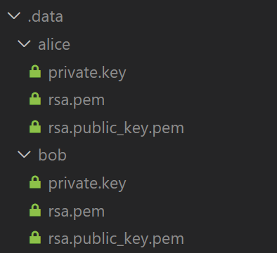

# messages-on-chain
PoC about message on blockchain
* Public messages
* Private messages encrypted using RSA (additional keys are required)
* Private messages encrypted using EC (the wallet's keys are used)

## Getting started
Create a .data directory

* *primary.key* is the wallet's private key (never shared)
* *rsa.pem* is the private key for RSA decryption (never shared)
* *rsa.public_key.pem* is the public key for RSA encryption  (shared)

### Wallet key
The wallet's private key should has balance great than zero to can write messages.
### Generate RSA keys
Generate private key

    $ openssl genrsa -out private_key.pem 4096

Generate public key

    openssl rsa -pubout -in private_key.pem -out public_key.pem